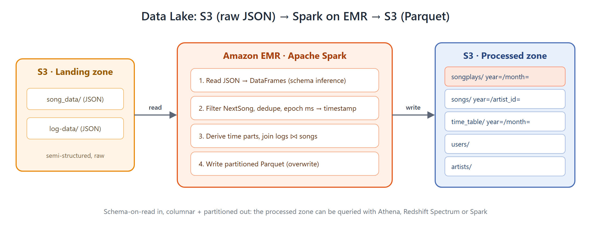
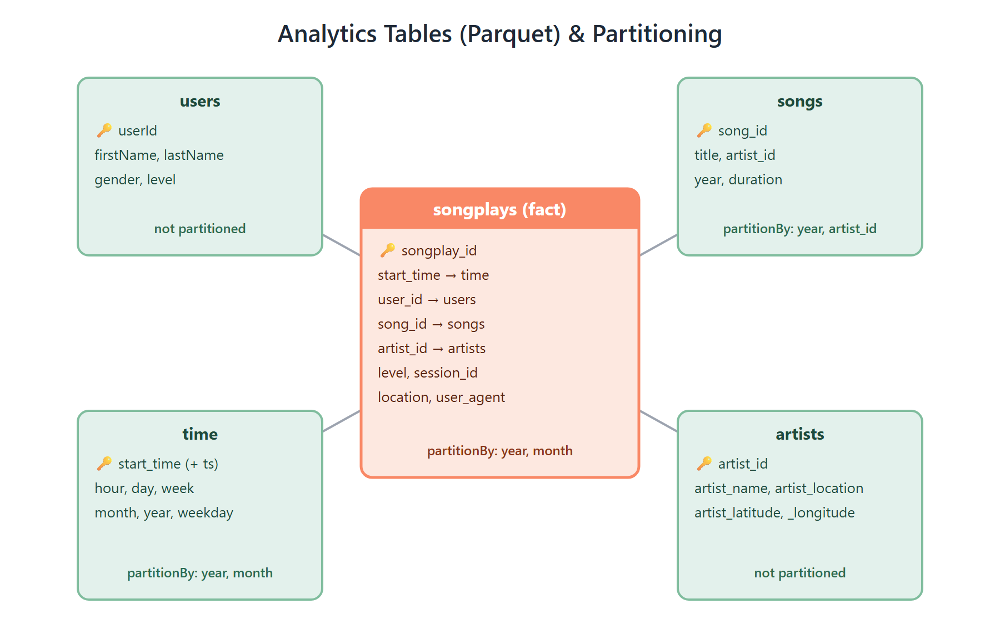

# Data Lake with Apache Spark on AWS EMR


> **A PySpark ELT job that turns raw JSON in an S3 landing zone into five partitioned Parquet analytics tables, running on an Amazon EMR cluster or on your laptop.**



---

## 🔍 What This Project Does

**From a warehouse to a data lake.**

A music streaming app ("Sparkify") has outgrown its data warehouse. Rather than loading everything into a database first, this project keeps the data in **S3** and uses **Apache Spark** to process it at scale:

1. **Read** semi-structured JSON straight from the S3 *landing zone* (schema-on-read).
2. **Process** it on a distributed Spark cluster on **Amazon EMR**: filter, deduplicate, convert timestamps, derive time attributes and join datasets.
3. **Write** five analytics tables back to an S3 *processed zone* as **columnar, partitioned Parquet**, ready for Spark SQL, Athena or Redshift Spectrum.

---

## 🔄 Spark Pipeline

| | Stage | Function | What happens |
|---|---|---|---|
| 📥 | Read songs | `process_song_data` | `spark.read.json("song_data/*/*/*/*")` in `PERMISSIVE` mode, so corrupt records are captured instead of crashing the job |
| 🎵 | Songs table | `process_song_data` | Select and dedupe, then write Parquet **partitioned by `year`, `artist_id`** |
| 🎤 | Artists table | `process_song_data` | Select and dedupe, then write Parquet |
| 📥 | Read logs | `process_log_data` | Read the event logs and keep only `page == "NextSong"` |
| 👤 | Users table | `process_log_data` | Distinct users, written to Parquet |
| 🕒 | Time table | `process_log_data` | UDF converts epoch ms to `TimestampType`, then derives hour, day, week, month, year and weekday. **Partitioned by `year`, `month`** |
| ⭐ | Songplays fact | `process_log_data` | Logs ⨝ songs (re-read from Parquet using partition discovery) ⨝ time. `monotonically_increasing_id()` gives the surrogate key. **Partitioned by `year`, `month`** |

All writes use `mode="overwrite"`, so the job is **idempotent** and safe to rerun.

---

## ⭐ Data Model



| Table | Type | Partitioned by | Columns |
|---|---|---|---|
| `songplays` | **Fact** | `year`, `month` | songplay_id, start_time, user_id, level, song_id, artist_id, session_id, location, user_agent |
| `users` | Dimension | n/a | userId, firstName, lastName, gender, level |
| `songs` | Dimension | `year`, `artist_id` | song_id, title, artist_id, year, duration |
| `artists` | Dimension | n/a | artist_id, artist_name, artist_location, artist_latitude, artist_longitude |
| `time_table` | Dimension | `year`, `month` | ts, start_time, hour, day, week, month, year, weekday |

**Why partitioned Parquet?** Parquet is columnar and compressed, so queries read only the columns they need. Partitioning by `year` and `month` lets queries filtered on time **skip whole folders** (partition pruning).

---

## 🛠️ What I Built and Changed

- **Wrote the PySpark ELT job**: JSON ingestion, filtering, deduplication, a timestamp UDF, time-dimension derivation, a three-way join and partitioned Parquet writes.
- **Designed the partitioning strategy** for each table based on how it's likely to be queried.
- **Fixed a startup crash**: AWS keys were read as `config['AWS_ACCESS_KEY_ID']`, which is a *section* lookup and always failed. Keys are now read from an `[AWS]` section and are **optional**, because EMR uses the cluster's IAM role.
- **Made the input and output paths command-line arguments** instead of a hardcoded bucket. The same script runs locally (`data/ → output/`) or on EMR (`s3://… → s3://…`).
- **Made the S3 connector conditional**: `hadoop-aws` is loaded only for `s3a://` paths, so local runs need no extra downloads and EMR uses its native S3 connector.
- **Included a sample dataset** (`data/`), with `.DS_Store` files removed, so the job can be run **for free on a laptop**.
- **Documented both run modes**: local (WSL + PySpark) and AWS EMR (`spark-submit` on YARN, or an EMR Step).

---

## ⚡ Quick Start

### 💻 Run locally (free, no AWS)

On Windows, use **WSL (Ubuntu)**:

```bash
# 1. Clone
git clone https://github.com/Khushipatel27/spark-emr-data-lake.git
cd spark-emr-data-lake

# 2. Install Java + PySpark
sudo apt update && sudo apt install -y openjdk-17-jre-headless python3-venv
python3 -m venv .venv && source .venv/bin/activate
pip install -r requirements.txt

# 3. Run the job
spark-submit etl.py data/ output/

# 4. Check the output
ls output/      # artists  songplays  songs  time_table  users
```

### ☁️ Run on AWS EMR

```bash
# 1. Upload data
aws s3 sync data/ s3://<your-bucket>/

# 2. Create an EMR cluster with Spark (e.g. 1 primary + 2 core m5.xlarge), then:
scp -i <key>.pem etl.py hadoop@<emr-primary-dns>:~/
ssh -i <key>.pem hadoop@<emr-primary-dns>

# 3. Submit
spark-submit --master yarn --deploy-mode client \
  --driver-memory 4g --num-executors 2 --executor-memory 2g --executor-cores 2 \
  etl.py s3://<your-bucket>/ s3://<your-bucket>/output/
```

> 💡 You can also upload `etl.py` to S3 and add it as an **EMR Step**. **Terminate the cluster** when it finishes, because EMR bills per second.

---

## 📚 Dataset

| | Source | Contents |
|---|---|---|
| 🎵 | `data/song_data/` | 71 JSON files from the [Million Song Dataset](http://millionsongdataset.com/), nested as `A/B/C/TR….json` |
| 📝 | `data/log-data/` | 30 daily JSON logs from an [event simulator](https://github.com/Interana/eventsim): **8,026 events**, **6,801 song plays**, 98 users |

---

## 📁 Project Structure

```
spark-emr-data-lake/
├── etl.py              ← PySpark job: read JSON → 5 tables → Parquet
├── requirements.txt    ← pyspark 3.5 (local runs)
├── dl.cfg.example      ← optional AWS keys for local s3a:// runs
│
├── data/               ← sample dataset (local input / upload to S3)
│   ├── log-data/       ← 30 event log files
│   └── song_data/      ← 71 song metadata files
│
├── docs/images/        ← architecture & data model diagrams
│
└── output/             ← created by local runs (gitignored)
```

---

## ⚠️ Notes

- `dl.cfg` (AWS keys) and `output/` are **gitignored**.
- On EMR there's no need for keys: the cluster's IAM role must be allowed to read and write your bucket.
- `songs` is partitioned by `artist_id`, which creates many small folders. That's fine for the sample, but worth revisiting at larger scale.

---

<p align="center">Built with ❤️ by <b>Khushi Patel</b></p>
