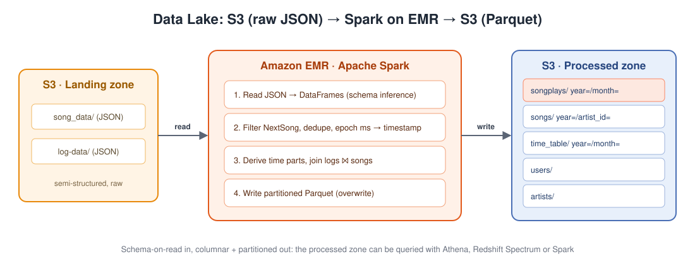
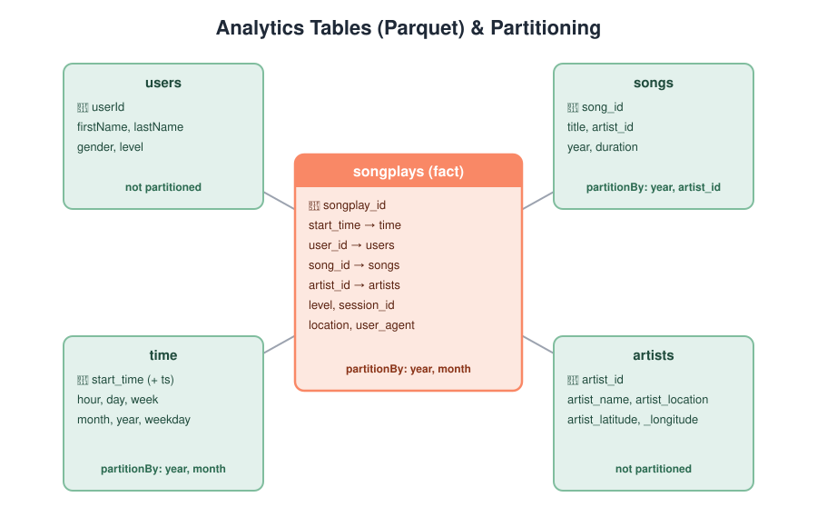

# Data Lake with Apache Spark on AWS EMR

A PySpark ELT job that reads raw JSON song and user-activity data from an **S3 landing zone**, processes it on an **Amazon EMR** Spark cluster into five analytics tables, and writes them back to S3 as **partitioned Parquet**. The output is a schema-on-read data lake that Spark, Athena or Redshift Spectrum can query.



## Tech Stack

`Apache Spark (PySpark)` · `Amazon EMR` · `Amazon S3` · `Parquet` · `Python`

## Problem

A music streaming startup ("Sparkify") has outgrown its data warehouse and wants to move to a data lake. Its data lives in S3 as JSON, as app activity logs and song metadata. This project builds a Spark job that turns that raw data into a set of analytics tables stored back in S3.

## How it works

`etl.py` runs two stages.

**`process_song_data`**
- Reads every song JSON file (`song_data/*/*/*/*`) with schema inference, in `PERMISSIVE` mode, so corrupt records don't crash the job.
- Builds **songs**, partitioned by `year` and `artist_id`, and **artists**, both deduplicated.

**`process_log_data`**
- Reads event logs and keeps only `NextSong` actions.
- Builds **users**.
- Converts epoch milliseconds to timestamps with a UDF, then derives hour, day, week, month, year and weekday into **time**, partitioned by `year` and `month`.
- Joins logs with songs, and then with time, to build the **songplays** fact table, partitioned by `year` and `month`, with `monotonically_increasing_id()` as a surrogate key.

All writes use `mode="overwrite"`, so rerunning the job is idempotent.

## Data Model



**Why Parquet with partitions?** Parquet is columnar and compressed, so queries read only the columns they need. Partitioning by `year` and `month` lets queries filtered on time skip whole folders (partition pruning).

## Project Structure

```
.
├── etl.py               # The Spark job
├── requirements.txt     # pyspark (for local runs)
├── dl.cfg.example       # AWS keys template, only for local runs against S3
├── data/                # Sample dataset (upload to S3 for EMR)
│   ├── log-data/        # 30 daily event log files
│   └── song_data/       # 71 song metadata files
└── docs/images/
```

---

## Running Locally (free, no AWS needed)

Spark needs Java and runs best on Linux, so use **WSL (Ubuntu)** on Windows.

```bash
# inside WSL, in this project folder
sudo apt update && sudo apt install -y openjdk-17-jre-headless python3-venv
python3 -m venv .venv && source .venv/bin/activate
pip install -r requirements.txt

spark-submit etl.py data/ output/
```

Check the output:
```bash
ls output/                       # artists  songplays  songs  time_table  users
python3 -c "from pyspark.sql import SparkSession as S; s=S.builder.getOrCreate(); df=s.read.parquet('output/songplays'); df.show(5); print(df.count())"
```

## Running on AWS EMR

1. **Upload the data:**
   ```bash
   aws s3 sync data/ s3://<your-bucket>/
   ```
2. **Create an EMR cluster** with the Spark application, for example 1 primary node and 2 core nodes of `m5.xlarge`, using the default EMR roles (they can read and write S3) and an EC2 key pair.
3. **Copy the job to the primary node and run it:**
   ```bash
   scp -i <key>.pem etl.py hadoop@<emr-primary-public-dns>:~/
   ssh -i <key>.pem hadoop@<emr-primary-public-dns>

   spark-submit --master yarn --deploy-mode client \
     --driver-memory 4g --num-executors 2 --executor-memory 2g --executor-cores 2 \
     etl.py s3://<your-bucket>/ s3://<your-bucket>/output/
   ```
   Alternatively, upload `etl.py` to S3 and add it as an EMR **Step** (Spark application) with the two paths as arguments.
4. **Check** that `s3://<your-bucket>/output/` contains the five table folders.
5. **Terminate the cluster** when it finishes. EMR bills by the second while it's running.
